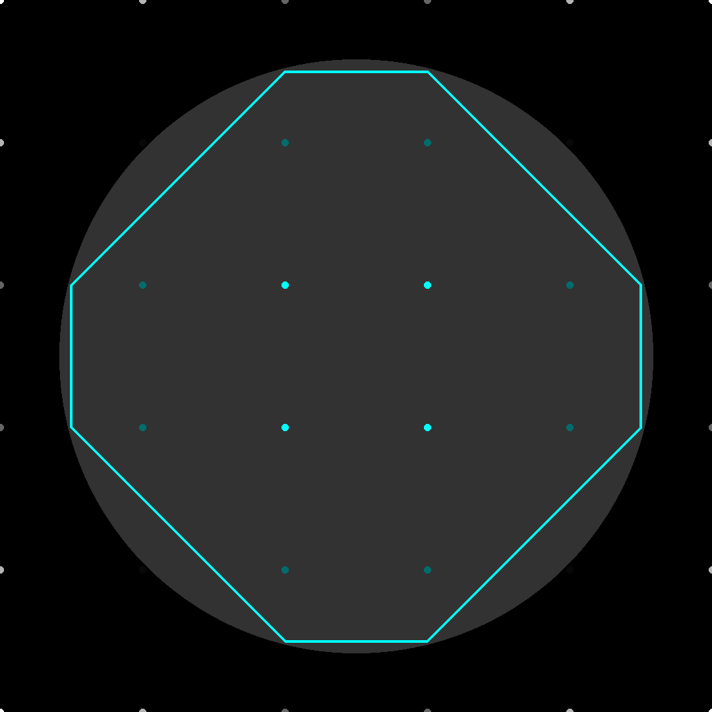

# marching-squares

An implementation of Marching Squares. Marching Squares is an algorithm that extracts edges from a function/field or 2D grid of values. This algorithm is useful whenever edge or boundary data is needed (toolpaths, for example). 

Marching Squares is a 2D version of "Marching Cubes", which is common in extracting surfaces as triangle meshes from 3D functions or fields and discrete 3D data such as MRI and CT scans.

---

### Basic Steps

For each square in a 2D grid:
1. Sample the data/field at each corner point
2. Construct a lookup ID/state from these four values and a threshold (typically 0)
3. Use this ID to look up the connections between edge midpoints to make based on a static edge table
4. Insert the edges from the table into a list and move to the next square
    

Since the number of binary combinations of the four corners is finite (16), a lookup table can be used to construct these edges very quickly.

The size of the sampling grid determines the "resolution" and thus the maximum deviation from the "actual" boundary the resulting edges will have.

---
### Examples

*Extracting the edges of an implicit circle defined by a signed distance function. The dot colors represent the values at each sampling location and the cyan lines are the extracted boundary.*

**Note: The only output of Marching Squares is the cyan line segments. The rest of what's shown in the images is for visualization only.*

Here is an example of different grid/marching square sizes:

||3|5|20|50|
|:--:|:--:|:--:|:--:|:--:|
|Midpoints only|||||
|Interpolated|||||

---

*The above images uses interpolation to "smooth" the boundary. If only midpoints between sampling locations are used, then the following result is produced:*

*Discrete input data, such as with an image, can be used as well. This example extracts the boundary of green regions. The image was first box blurred prior to sampling to allow interpolation to smooth the boundary.*

---

References: 
- http://paulbourke.net/geometry/polygonise/
- https://thecodingtrain.com/challenges/c5-marching-squares
- https://en.wikipedia.org/wiki/Marching_squares